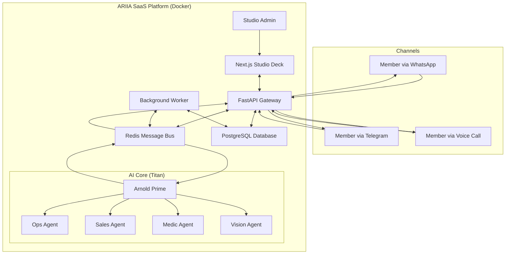

# ARIIA v2.0.0 🤖 – Multi-Tenant AI Agent Platform

**ARIIA** (formerly ARNI) is a sophisticated, multi-tenant SaaS platform designed to automate and enhance member interactions for fitness studios. It acts as a digital front-desk assistant, leveraging a powerful AI agent swarm to manage communications, bookings, and member support across multiple channels like WhatsApp, Telegram, and Voice.

[](https://services.frigew.ski/ariia)

---

## ✨ Core Features

ARIIA has evolved far beyond a simple chatbot into a comprehensive studio management and automation platform. The current version is a production-ready, multi-tenant SaaS application.

| Feature | Description |
| :--- | :--- |
| **Multi-Tenant SaaS** | Securely manage multiple independent fitness studios (tenants) with isolated data, configurations, and billing. |
| **AI Agent Swarm** | A "Project Titan" Orchestrator-Worker architecture (Arnold Prime) delegates tasks to specialized agents (Ops, Sales, Medic, Vision) for superior problem-solving. |
| **Studio Deck** | A comprehensive web frontend (Next.js) for tenant admins to monitor conversations, manage members, view analytics, and configure the system. |
| **Multi-Channel Comms** | Seamlessly integrates with **WhatsApp**, **Telegram**, and **Voice** (STT/TTS), normalizing messages into a unified pipeline. |
| **Advanced CRM** | Rich member profiles with activity tracking, booking history, preference analysis, and automated data enrichment via **Magicline** integration. |
| **Churn Prediction** | Proactively identifies at-risk members using activity data and configurable churn-scoring rules. |
| **3-Tier Memory System** | Combines short-term (Redis), long-term (PostgreSQL), and knowledge-base (Vector DB/Markdown) memory for deep, contextual conversations. |
| **Billing & Subscriptions** | A robust feature-gating system manages different SaaS plans (Starter, Pro, Enterprise) and enforces usage limits. |
| **Security & Governance** | Built with enterprise-grade security, including strict authentication, tenant data isolation (RLS), and encrypted API keys. |

## 🏛️ Architecture

The system is designed as a decoupled, service-oriented architecture, orchestrated via a central Redis message bus.



## 🚀 Getting Started

The entire platform is containerized and can be launched with a single command using Docker Compose.

**Prerequisites:**
* Docker & Docker Compose
* An `.env` file configured with your API keys and secrets (see `.env.example`).

```bash
# 1. Clone the repository
git clone https://github.com/DamienDrash/ariia.git
cd arni

# 2. Configure your environment
cp .env.example .env
# Edit .env with your keys (OpenAI, Meta, etc.)

# 3. Launch the platform
docker compose up -d --build
```

Your services will be available at:
* **Studio Deck (Frontend):** `https://services.frigew.ski/ariia`
* **ARIIA Gateway (Backend):** `http://localhost:8000/docs`

## 💻 Technology Stack

| Area | Technology |
| :--- | :--- |
| **Backend** | Python 3.12, FastAPI, PostgreSQL, Redis, SQLAlchemy, Pydantic |
| **Frontend** | Next.js 16, React 19, TypeScript, TailwindCSS, Framer Motion |
| **AI & ML** | OpenAI (GPT-4o), YOLOv8, Whisper STT, ElevenLabs TTS, Qdrant |
| **DevOps** | Docker, Docker Compose, Alembic, Pytest, LangFuse, Prometheus |

## 📁 Project Structure

```
ariia/
├── app/                  # Core Backend Application
│   ├── core/             # Auth, DB Models, Feature Gates, Security
│   ├── gateway/          # FastAPI Routers (Admin, Webhooks, WebSockets)
│   ├── integrations/     # Connectors (WhatsApp, Telegram, Magicline)
│   ├── memory/           # 3-Tier Memory & Knowledge Base System
│   ├── swarm/            # AI Agent Swarm (Arnold Prime & Workers)
│   └── ...               # Other modules (Voice, Vision, etc.)
├── frontend/             # Next.js Studio Deck Application
│   ├── app/              # Next.js App Router, Pages & API Routes
│   └── components/       # Reusable React Components
├── tests/                # Backend Pytest Integration & Unit Tests
├── alembic/              # Database Migration Scripts
├── docs/                 # Project Documentation & Architecture Specs
├── scripts/              # Utility and operational scripts
├── docker-compose.yml    # Defines all application services
└── pyproject.toml        # Python project definition and dependencies
```

## 🧪 Testing

The project maintains a high standard of quality with a comprehensive test suite.

```bash
# Run all backend tests inside the container
docker compose exec ariia-core pytest -v
```

* **36+** detailed test files covering all critical modules.
* Integration tests for authentication, multi-tenancy, and core agent logic.
* End-to-end tests for the frontend using Playwright.

## 🗺️ Roadmap

This project is actively being developed into a high-end, enterprise-ready SaaS platform. The roadmap, detailed in `docs/sprints/SAAS_ROADMAP.md`, includes further enhancements to security, billing, and white-labeling capabilities.

## 📄 License

This project is licensed under the MIT License. See the [LICENSE](LICENSE) file for details.

---

> Built with ❤️ for the future of fitness | ARIIA v2.0.0
