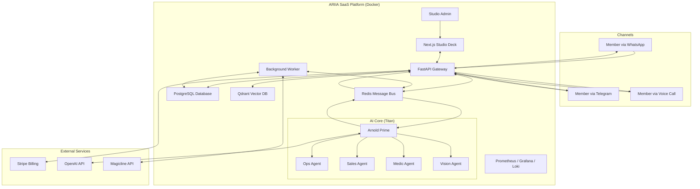

# ARIIA v2.1.0 – Multi-Tenant AI Agent Platform

**ARIIA** (formerly ARNI) is a sophisticated, multi-tenant SaaS platform designed to automate and enhance member interactions for fitness studios. It acts as a digital front-desk assistant, leveraging a powerful AI agent swarm to manage communications, bookings, and member support across multiple channels like WhatsApp, Telegram, and Voice.

[](https://www.ariia.ai)
[](https://www.ariia.ai)

---

## Core Features

ARIIA has evolved far beyond a simple chatbot into a comprehensive studio management and automation platform. The current version is a production-ready, multi-tenant SaaS application.

| Feature | Description |
| :--- | :--- |
| **Multi-Tenant SaaS** | Securely manage multiple independent fitness studios (tenants) with isolated data, configurations, and billing. |
| **AI Agent Swarm** | A "Project Titan" Orchestrator-Worker architecture (Arnold Prime) delegates tasks to specialized agents (Ops, Sales, Medic, Vision) for superior problem-solving. |
| **Studio Deck** | A comprehensive web frontend (Next.js) for tenant admins to monitor conversations, manage members, view analytics, and configure the system. |
| **Multi-Channel Comms** | Seamlessly integrates with **WhatsApp**, **Telegram**, and **Voice** (STT/TTS), normalizing messages into a unified pipeline. |
| **Advanced CRM** | Rich member profiles with activity tracking, booking history, preference analysis, and automated data enrichment via **Magicline** integration. |
| **Churn Prediction** | Proactively identifies at-risk members using activity data and configurable churn-scoring rules. |
| **3-Tier Memory System** | Combines short-term (Redis), long-term (PostgreSQL), and knowledge-base (Vector DB/Markdown) memory for deep, contextual conversations. |
| **Stripe Billing** | Full Stripe integration with subscription management, plan upgrades/downgrades with proration, cancellation at period end, and real-time revenue tracking. |
| **Infrastructure Dashboard** | Remote Docker container management via Web-UI with real-time stats, log viewer, and container lifecycle controls. |
| **Security & Governance** | Built with enterprise-grade security, including strict authentication, RBAC, tenant data isolation (RLS), and encrypted API keys. |

---

## Architecture

The system is designed as a decoupled, service-oriented architecture, orchestrated via a central Redis message bus and deployed as a fleet of Docker containers.



---

## Billing & Subscription Management

ARIIA implements a gold-standard SaaS billing system powered by Stripe.

| Capability | Implementation |
| :--- | :--- |
| **Plan Tiers** | Starter (49 EUR/mo), Professional (199 EUR/mo), Business (399 EUR/mo), Enterprise (custom) |
| **Upgrades** | Immediate activation via `Subscription.modify()` with prorated billing |
| **Downgrades** | Scheduled for period end via `proration_behavior: none` |
| **Cancellation** | `cancel_at_period_end` preserves access until billing cycle ends |
| **Reactivation** | Cancelled subscriptions can be reactivated before period end |
| **Webhooks** | Primary plan activation via `checkout.session.completed`, `customer.subscription.updated/deleted`, `invoice.paid/payment_failed` |
| **Verify-Session** | Frontend fallback that verifies Stripe session on redirect return |
| **Revenue Tracking** | Real-time MRR, ARR, and invoice data pulled directly from Stripe API |
| **Account Deactivation** | Danger zone in account settings with Stripe subscription cancellation and tenant deactivation |

---

## Infrastructure Dashboard

The System-Admin interface includes a Docker container management dashboard accessible at `/infrastructure`.

| Feature | Description |
| :--- | :--- |
| **Container Overview** | Lists all Docker containers with status, health, uptime, ports, and image info |
| **Live Resource Stats** | Real-time CPU, memory, network I/O, and PID metrics per container (auto-refreshing) |
| **Log Viewer** | Modal-based log viewer with last 500 lines per container |
| **Container Actions** | Start, stop, and restart containers with confirmation dialogs |
| **Self-Protection** | The core container (`ariia_core`) cannot be stopped or restarted from the UI |
| **System Info** | Docker version, host OS, CPU count, total memory, storage driver, and image count |

---

## Getting Started

The entire platform is containerized and can be launched with a single command using Docker Compose.

**Prerequisites:**
* Docker & Docker Compose v2+
* An `.env` file configured with your API keys and secrets (see `.env.example`)

```bash
# 1. Clone the repository
git clone https://github.com/DamienDrash/ariia.git
cd ariia

# 2. Configure your environment
cp .env.example .env
# Edit .env with your keys (OpenAI, Stripe, Meta, etc.)

# 3. Launch the platform
docker compose up -d --build
```

Your services will be available at:
* **Studio Deck (Frontend):** `https://www.ariia.ai` (or `http://localhost:3000`)
* **ARIIA Gateway (Backend):** `http://localhost:8000/docs`
* **Grafana Monitoring:** `http://localhost:3001`
* **Prometheus Metrics:** `http://localhost:9090`

---

## Technology Stack

| Area | Technology |
| :--- | :--- |
| **Backend** | Python 3.12, FastAPI, PostgreSQL, Redis, SQLAlchemy, Pydantic v2 |
| **Frontend** | Next.js 16, React 19, TypeScript, TailwindCSS, Framer Motion |
| **AI & ML** | OpenAI (GPT-4o), YOLOv8, Faster-Whisper STT, Kokoro/Piper TTS, Qdrant |
| **Billing** | Stripe (Checkout, Subscriptions, Webhooks, Customer Portal) |
| **Monitoring** | Prometheus, Grafana, Loki, Promtail, cAdvisor, Alertmanager |
| **DevOps** | Docker, Docker Compose, Alembic, Pytest, LangFuse |

---

## Services Overview

The platform runs as a fleet of 16 Docker containers:

| Service | Container | Purpose |
| :--- | :--- | :--- |
| `ariia-core` | `ariia_core` | FastAPI backend gateway, AI orchestration, API endpoints |
| `ariia-frontend` | `ariia_frontend` | Next.js Studio Deck web application |
| `ariia-worker` | `ariia_worker` | Background task processing (CRM sync, churn scoring) |
| `ariia-telegram-polling` | `ariia_telegram_polling` | Telegram bot polling service |
| `ariia-postgres` | `ariia_postgres` | PostgreSQL database with RLS |
| `ariia-redis` | `ariia_redis` | Redis message bus and cache |
| `ariia-qdrant` | `ariia_qdrant` | Qdrant vector database for knowledge base |
| `prometheus` | `ariia_prometheus` | Metrics collection |
| `grafana` | `ariia_grafana` | Monitoring dashboards |
| `loki` | `ariia_loki` | Log aggregation |
| `promtail` | `ariia_promtail` | Log shipping agent |
| `alertmanager` | `ariia_alertmanager` | Alert routing and notification |
| `cadvisor` | `ariia_cadvisor` | Container resource metrics |
| `node-exporter` | `ariia_node_exporter` | Host system metrics |
| `postgres-exporter` | `ariia_postgres_exporter` | PostgreSQL metrics |
| `redis-exporter` | `ariia_redis_exporter` | Redis metrics |

---

## Project Structure

```
ariia/
├── app/                      # Core Backend Application
│   ├── core/                 # Auth, DB Models, Feature Gates, Security, RBAC
│   ├── gateway/              # FastAPI Routers & Middleware
│   │   ├── main.py           # Application entry point
│   │   ├── admin.py          # Tenant admin endpoints
│   │   ├── billing.py        # Stripe billing & subscription management
│   │   ├── docker_management.py  # Docker container remote management
│   │   ├── revenue_analytics.py  # Stripe-based revenue tracking
│   │   └── ...               # Other routers (auth, webhooks, websockets)
│   ├── integrations/         # Connectors (WhatsApp, Telegram, Magicline)
│   ├── memory/               # 3-Tier Memory & Knowledge Base System
│   ├── swarm/                # AI Agent Swarm (Arnold Prime & Workers)
│   └── ...                   # Other modules (Voice, Vision, etc.)
├── frontend/                 # Next.js Studio Deck Application
│   ├── app/                  # Next.js App Router, Pages & API Routes
│   │   ├── [locale]/         # Internationalized routes
│   │   │   ├── (system-admin)/  # System admin pages
│   │   │   │   ├── infrastructure/  # Docker management dashboard
│   │   │   │   ├── revenue/         # Revenue analytics
│   │   │   │   ├── tenants/         # Tenant management
│   │   │   │   └── ...
│   │   │   └── (tenant)/    # Tenant-scoped pages
│   │   │       ├── settings/
│   │   │       │   ├── billing/     # Subscription & plan management
│   │   │       │   ├── account/     # Account settings & danger zone
│   │   │       │   └── ...
│   │   │       └── ...
│   ├── components/           # Reusable React Components
│   └── lib/                  # Utilities, API client, RBAC
├── config/                   # Configuration files
├── tests/                    # Backend Pytest Integration & Unit Tests
├── alembic/                  # Database Migration Scripts
├── docs/                     # Project Documentation & Architecture Specs
├── scripts/                  # Utility and operational scripts
├── docker-compose.yml        # Defines all 16 application services
├── Dockerfile                # Multi-stage Python backend image
├── pyproject.toml            # Python project definition and dependencies
└── .env                      # Environment configuration (not committed)
```

---

## API Endpoints

### Billing & Subscription (`/admin/billing/`)

| Method | Endpoint | Description |
| :--- | :--- | :--- |
| `GET` | `/plans` | List available subscription plans |
| `GET` | `/subscription` | Get current tenant subscription |
| `POST` | `/checkout-session` | Create Stripe Checkout session |
| `POST` | `/verify-session` | Verify completed checkout session |
| `POST` | `/change-plan` | Upgrade or downgrade subscription |
| `POST` | `/preview-plan-change` | Preview proration for plan change |
| `POST` | `/cancel-subscription` | Cancel subscription at period end |
| `POST` | `/reactivate-subscription` | Reactivate cancelled subscription |
| `POST` | `/deactivate-account` | Deactivate tenant account |
| `POST` | `/customer-portal` | Create Stripe Customer Portal session |
| `POST` | `/webhook` | Stripe webhook handler |

### Docker Management (`/admin/docker/`)

| Method | Endpoint | Description |
| :--- | :--- | :--- |
| `GET` | `/containers` | List all Docker containers |
| `GET` | `/containers/{id}/stats` | Get container resource statistics |
| `GET` | `/containers/{id}/logs` | Get container log output |
| `POST` | `/containers/{id}/start` | Start a stopped container |
| `POST` | `/containers/{id}/stop` | Stop a running container |
| `POST` | `/containers/{id}/restart` | Restart a container |
| `GET` | `/system-info` | Get Docker host system information |

### Revenue Analytics (`/admin/revenue/`)

| Method | Endpoint | Description |
| :--- | :--- | :--- |
| `GET` | `/overview` | Revenue overview with MRR/ARR from Stripe |
| `GET` | `/tenants` | Per-tenant revenue breakdown |
| `GET` | `/stripe-invoices` | List all Stripe invoices |

---

## Testing

The project maintains a high standard of quality with a comprehensive test suite.

```bash
# Run all backend tests inside the container
docker compose exec ariia-core pytest -v
```

* **36+** detailed test files covering all critical modules.
* Integration tests for authentication, multi-tenancy, and core agent logic.
* End-to-end tests for the frontend using Playwright.

---

## Recent Changes (v2.1.0)

- **Stripe Billing Integration:** Full checkout flow with plan upgrades/downgrades, proration, cancellation, and reactivation
- **Revenue Analytics:** Real-time MRR/ARR tracking from Stripe invoices (replaces local calculation)
- **Infrastructure Dashboard:** Docker container management via Web-UI with live stats, logs, and lifecycle controls
- **Account Management:** Danger zone in account settings for subscription cancellation and account deactivation
- **Build Fixes:** Resolved duplicate key errors in members page, fixed routing issues for billing endpoints

---

## License

This project is licensed under the MIT License. See the [LICENSE](LICENSE) file for details.

---

> Built with precision for the future of fitness | ARIIA v2.1.0
