# Conversation Flow Templates (Sprint 3, Task 3.7)

> **Designer:** @UX | **Datum:** 2026-02-14 | **Referenz:** AGENTS.md, SOUL.md

---

## 1. Booking Flow (Happy Path)

```mermaid
sequenceDiagram
    participant U as User (WhatsApp)
    participant A as Arni (Agent Ops)
    participant M as Magicline API

    U->>A: "Ich will einen Kurs buchen"
    A->>A: Intent: BOOKING → Agent Ops

    A->>U: "Klar, ich check die Kurse! 📋<br/>Was für einen Kurs suchst du?"

    U->>A: "Yoga morgen"
    A->>M: GET /courses?date=tomorrow&name=yoga
    M-->>A: [Yoga 09:00 (5 frei), Yoga 18:00 (2 frei)]

    A->>U: [WhatsApp List] "🏋️ Yoga – Wähle deinen Termin"

    U->>A: [Button Reply] "18:00"
    A->>U: [Confirm Buttons] "📋 Yoga, morgen 18:00 – Buchen?"

    U->>A: [Button] "✅ Ja, buchen!"
    A->>M: POST /bookings {course: yoga, time: 18:00}
    M-->>A: {status: confirmed, id: B-42}

    A->>U: "Gebucht! 🎉 Yoga morgen 18:00.<br/>Viel Spaß! 💪"
```

---

## 2. Cancellation Flow (Retention + One-Way-Door)

```mermaid
sequenceDiagram
    participant U as User
    participant A as Arni (Agent Sales)
    participant G as Ghost Mode Admin

    U->>A: "Ich will kündigen"
    A->>A: Intent: SALES → Agent Sales
    A->>A: ⚠️ Type-2 Aktion (One-Way-Door)

    A->>U: "Schade! 😔 Bevor wir kündigen –<br/>ich hab Alternativen:"
    A->>U: [Buttons] "⏸️ Pause | ⬇️ Downgrade | 🎁 Bonus"

    Note over G: 🔔 Ghost Mode: Kündigung erkannt

    alt User wählt Alternative
        U->>A: [Button] "⏸️ Pause"
        A->>U: "Super! Ich pausiere dein Abo.<br/>Du kannst jederzeit zurückkommen! 💪"
    else User besteht auf Kündigung
        U->>A: "Nein, ich will wirklich kündigen"
        A->>U: [Confirm] "⚠️ Bist du sicher?<br/>Antworte mit JA"
        U->>A: "JA"
        A->>G: 🚨 Admin-Alert: Kündigung bestätigt
        A->>U: "Kündigung eingeleitet. Schade! 😢<br/>Du bist immer willkommen."
    end
```

---

## 3. FAQ Flow (Intent → Agent → Response)

```mermaid
sequenceDiagram
    participant U as User
    participant R as Router (GPT-4o-mini)
    participant A as Arni (passender Agent)

    U->>R: "Wann habt ihr offen?"
    R->>R: classify("Wann habt ihr offen?")
    R->>R: Intent: BOOKING (0.95)
    R->>A: dispatch → Agent Ops

    A->>U: "📍 GetImpulse Berlin<br/>Mo–Fr: 06:00–23:00<br/>Sa–So: 08:00–21:00<br/>Feiertage: 09:00–18:00"

    Note over U,A: Kein LLM nötig – hardcoded response
```

---

## Design-Regeln

| Regel | Beschreibung |
|-------|-------------|
| **Max 3 Buttons** | WhatsApp-Limit, immer eine "Zurück"-Option |
| **Bestätigung bei Type-2** | AGENTS.md §1: JA/NEIN vor irreversiblen Aktionen |
| **Emoji sparsam** | Max 1-2 pro Nachricht (SOUL.md) |
| **Arni-Persona** | Nie "Ich bin ein Bot", immer in Character |
| **Fallback** | Bei Unklarheit: "Kann ich dir sonst helfen?" |
