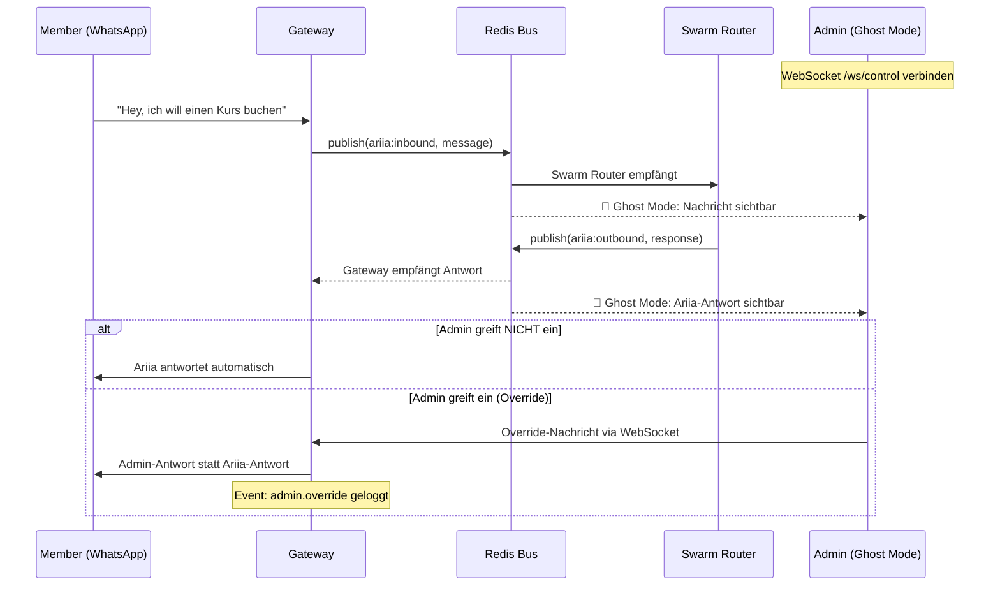

# Ghost Mode UX Flow (Sprint 1, Task 1.17)

> **Designer:** @UX | **Datum:** 2026-02-14 | **Endpoint:** `WS /ws/control`

---

## Konzept

Ghost Mode erlaubt Trainern/Admins, Live-Konversationen von Ariia mitzulesen, ohne dass der User (Member) davon weiß. Der Admin kann bei Bedarf eingreifen und die Antwort überschreiben.

---

## Flow-Diagramm



---

## Screens & Zustände

### 1. Verbindung

```
┌──────────────────────────────────┐
│ 🟢 Ghost Mode – Verbunden       │
│ ─────────────────────────────── │
│ Aktive Konversationen: 3         │
│ Letzte Nachricht: vor 2s         │
└──────────────────────────────────┘
```

### 2. Live-Chat Ansicht

```
┌──────────────────────────────────┐
│ 👤 Max M. (+49 170 123...)       │
│ ─────────────────────────────── │
│ [14:23] Max: "Ist es gerade     │
│          voll?"                   │
│                                   │
│ [14:23] 🤖 Ariia: "📊 Aktuelle   │
│          Auslastung: mittel"      │
│                                   │
│ ─────────────────────────────── │
│ [Override eingeben...]    [Send] │
└──────────────────────────────────┘
```

### 3. Override-Modus

```
┌──────────────────────────────────┐
│ ⚠️ OVERRIDE AKTIV               │
│ ─────────────────────────────── │
│ Ariia's Entwurf:                  │
│ "📊 Auslastung: mittel (~25)"   │
│                                   │
│ Ihre Nachricht:                  │
│ ┌──────────────────────────────┐ │
│ │ Heute sogar besonders ruhig,│ │
│ │ komm vorbei! 💪              │ │
│ └──────────────────────────────┘ │
│                                   │
│ [Ariia senden] [Override senden] │
└──────────────────────────────────┘
```

---

## WebSocket Message Types

| Type | Richtung | Beschreibung |
|------|----------|-------------|
| `ghost.message_in` | Server → Admin | Neue User-Nachricht |
| `ghost.message_out` | Server → Admin | Ariia's Antwort-Entwurf |
| `ghost.override` | Admin → Server | Admin überschreibt Ariia |
| `ghost.approve` | Admin → Server | Admin bestätigt Ariia's Antwort |
| `admin.connected` | Server → Redis | Admin hat sich verbunden |
| `admin.disconnected` | Server → Redis | Admin hat sich getrennt |

---

## Sicherheitsregeln

1. **Authentifizierung:** WebSocket-Verbindung braucht Auth-Token (Sprint 3)
2. **Logging:** Jeder Override wird geloggt (`event_type: admin.override`)
3. **PII:** Admin sieht nur Vorname + letzte 3 Ziffern der Nummer
4. **Timeout:** Ariia antwortet automatisch nach 30s ohne Admin-Override
5. **One-Way-Door:** Override bei Medic-Themen erfordert Bestätigung
